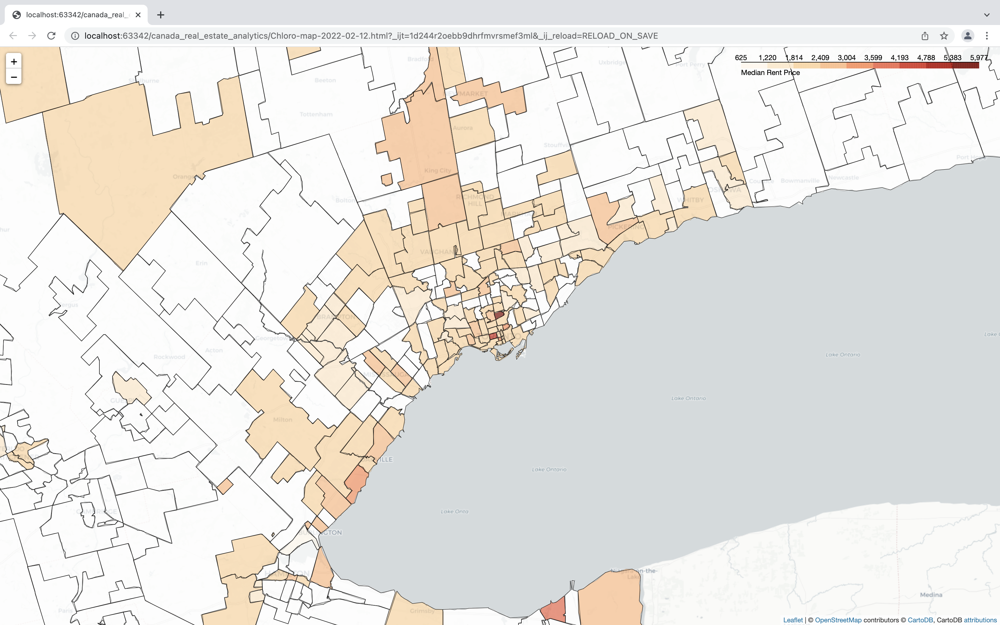

## About the project:
The project **canada_real_estate_analytics** is created to analyse and visualise mean prices of 1-bedroom apartments rent in different places of Canada. 
Moreover, the gathered data is divided by FSA (Forward Sortation Areas), as the division by cities is too broad, while division by neighbourhoods or precise ZIP-codes is too narrow (and it's almost impossible to find the actual borders of precise ZIP-codes).
## Project structure:
```
canada_real_estate_analytics
├── .gitignore
├── README.md
├── app
│   ├── __init__.py
│   ├── app.py
│   ├── client
│   │   ├── __init__.py
│   │   ├── static
│   │   │   ├── canada_topo.js
│   │   │   ├── main.css
│   │   │   └── main.js
│   │   └── templates
│   │       └── index.html
│   └── server
│       ├── __init__.py
│       ├── db.py
│       └── models.py
├── create_map_from_data.py
├── data-gatherer.py
├── gathering_scripts
│   ├── __init__.py
│   ├── db
│   │   ├── DBConnector.py
│   │   └── __init__.py
│   ├── realtor_enums
│   │   ├── RealtorEnums.py
│   │   └── __init__.py
│   ├── realtor_scripts
│   │   ├── __init__.py
│   │   ├── scrape_realtor_ca.py
│   │   └── zillow_scrape.py
│   └── rent_helpers
│       ├── GeoHelper.py
│       └── __init__.py
├── img
│   └── toronto-map.png
├── map_generator
│   ├── __init__.py
│   └── map_generator.py
└── requirements.txt

```
## Where to find the files:
- lfsa.shp: https://www12.statcan.gc.ca/census-recensement/2011/geo/bound-limit/files-fichiers/2016/lfsa000b16a_e.zip 
- apptdata.db - gather yourself with the project

Convert shp file with the command:
```
ogr2ogr -f GeoJSON -t_srs crs:84 lfsa.geojson lfsa000b16a_e.shp
```
## How to use:
What the code does:
1. It scrapes data from zillow.com and realtor.ca, if the scraped address does not contain ZIP-code, the ZIP code is requested by latitude and longitude parameters, then the data are saved to the DB;
2. The choropleth map is generated based on the data from the DB.

To use the project first:
```commandline
pip3 install -r requirements.txt
```

To gather data you need: 
```commandline
cd canada_real_estate_analytics
/venv/bin/python ./data-gatherer.py
```

To generate map:
```commandline
cd canada_real_estate_analytics
/venv/bin/python ./create_map_from_data.py
```
**Do not bother if there are errors like the one below - that's ok, the program keeps working.**
```
Traceback (most recent call last):
  File "/Users/newuser/PycharmProjects/scrape_classroom/venv/lib/python3.8/site-packages/geopy/extra/rate_limiter.py", line 136, in _retries_gen
    yield i  # Run the function.
  File "/Users/newuser/PycharmProjects/scrape_classroom/venv/lib/python3.8/site-packages/geopy/extra/rate_limiter.py", line 274, in __call__
    res = self.func(*args, **kwargs)
  File "/Users/newuser/PycharmProjects/scrape_classroom/venv/lib/python3.8/site-packages/geopy/geocoders/nominatim.py", line 362, in reverse
    return self._call_geocoder(url, callback, timeout=timeout)
  File "/Users/newuser/PycharmProjects/scrape_classroom/venv/lib/python3.8/site-packages/geopy/geocoders/base.py", line 368, in _call_geocoder
    result = self.adapter.get_json(url, timeout=timeout, headers=req_headers)
  File "/Users/newuser/PycharmProjects/scrape_classroom/venv/lib/python3.8/site-packages/geopy/adapters.py", line 438, in get_json
    resp = self._request(url, timeout=timeout, headers=headers)
  File "/Users/newuser/PycharmProjects/scrape_classroom/venv/lib/python3.8/site-packages/geopy/adapters.py", line 460, in _request
    raise GeocoderUnavailable(message)
geopy.exc.GeocoderUnavailable: HTTPSConnectionPool(host='nominatim.openstreetmap.org', port=443): Max retries exceeded with url: /reverse?lat=53.455162&lon=-113.49506&format=json&addressdetails=1 (Caused by ConnectTimeoutError(<urllib3.connection.HTTPSConnection object at 0x119d5eb50>, 'Connection to nominatim.openstreetmap.org timed out. (connect timeout=1)'))
```
## Result: 


#### Warning:
The project is quite slow and opening the map takes time, as the generated file weights 400MB because of lfsa.geojson data.
